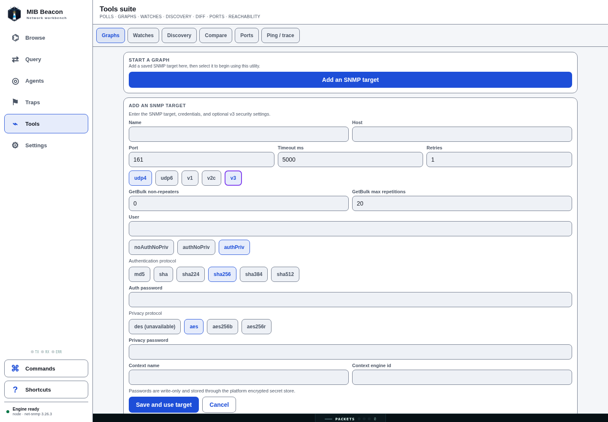
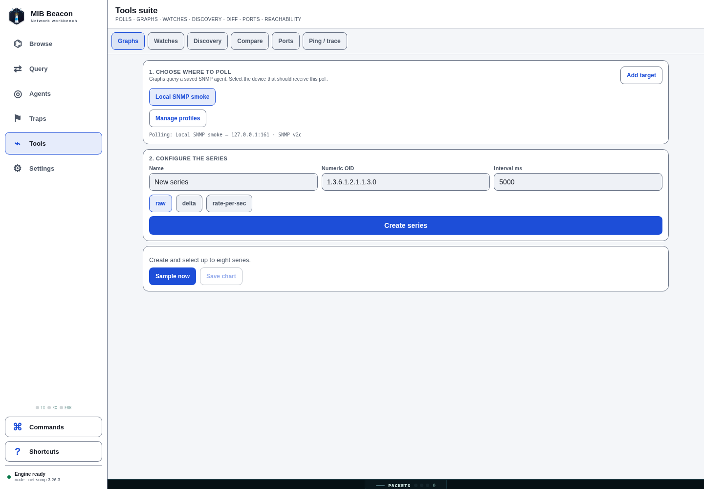

# Tools section browser E2E — 2026-07-15

## Scope and environment

This pass exercised the LAN/server web UI in Chromium at a 1440×1000 viewport against a
real local SNMP daemon at `127.0.0.1:161`. It used an isolated temporary server data
directory and a freshly generated `MIB_BEACON_SERVER_SECRET_KEY`; neither the key nor test
credentials are stored in this repository.

The test created two saved v2c profiles for the local daemon, one raw `sysUpTime` poll
series at 250 ms, and a `> 0` watch. The low interval is only for a quick, observable
chart/watch test; it is not a recommended production polling interval.

## Fixes validated

1. **Server saved-agent support** — the LAN server now injects an AES-256-GCM persistent
   secret store and verifies every saved ciphertext before it starts listening. Before the
   fix, creating an agent through the browser failed because the default Node transport
   refuses to persist unencrypted credentials. Compose now requires
   `MIB_BEACON_SERVER_SECRET_KEY`; a changed valid-looking key or tampered credential file
   now fails startup instead of reporting readiness with unusable profiles. See [the
   LAN-server setup](../../README.md#web-lan-server).
2. **Complete graph history over WebSocket** — the browser proxy now omits trailing
   `undefined` RPC arguments before JSON serialization. Previously, the optional poll-sample
   limit arrived at the server as `null`, which coerced to zero and was clamped to one sample.
   The graph and sparkline therefore had no visible line despite persisted history.
3. **Target-first tool onboarding** — Graphs, Compare, and Ports now explain that they need a
   saved SNMP target before their query controls are shown. Each path has an inline **Add an
   SNMP target** action rather than requiring users to discover the separate Agents screen.
4. **Full inline SNMP setup** — the inline target form supports UDP4/UDP6, v1/v2c communities,
   timeouts/retries/GetBulk tuning, and all v3 inputs (user, security level, auth/privacy
   protocols and write-only passwords, context name, and context engine ID). The cipher buttons
   still honor runtime availability. A newly saved target is selected automatically and only the
   non-secret endpoint/version summary is displayed.

## Results

| Tool | Browser scenario | Observed result |
| --- | --- | --- |
| Graphs | Created a `sysUpTime` series, waited for multiple samples, exported PNG | Multi-point blue history line rendered; exported PNG had the expected PNG signature and rendered successfully. |
| Watches | Saved `Uptime positive` using `value > 0` | The next scheduled sample changed the card to **BREACH** with current/min/max/average data. |
| Discovery | Scanned `127.0.0.1/32` with the saved profile | Completed `1/1 · 1 found`, with the host, SNMP version, credential attribution, latency, and row actions shown. |
| Compare | Live-walked the two saved local profiles | The aligned diff rendered five changed counter/time rows. The profiles intentionally point at the same host, so time-varying counters are expected to differ between serial walks. |
| Ports | Loaded local `ifTable` / `ifXTable` | Rendered live interfaces with admin/oper pills, HC-counter availability, speeds, octets, filters, sorts, and graph actions. |
| Ping | Ran two ICMP probes against `127.0.0.1` | Streamed two replies and showed `2/2 received · 0% loss` plus min/avg/max latency. |
| Target onboarding | Opened the empty Graphs state, saved v2c and v3 `authPriv` targets, then opened Compare and Ports | The v3-only fields appeared; both saves selected the new target and exposed graph configuration; Compare and Ports each exposed the same full setup path. |

No browser console errors were observed during the final E2E pass.

### Target-onboarding browser pass

The follow-up onboarding passes ran in Chromium at 1440×1000 against fresh, isolated LAN server
data directories. They verified the empty-state CTA, v2c creation, valid v3 `authPriv` creation
with SHA-256/AES, automatic Graphs selection, and the inline setup entry points in Compare and
Ports. The v3 pass verified that neither saved password was rendered after creation. A separate
browser pass switched from a partially completed Graphs form to Compare and verified that Name,
Host, and Community were cleared; unfinished credentials therefore cannot carry across tool
workflows. None of the passes reported browser console or page errors. The v3 check covered
profile creation and credential handling; it did not perform a live poll against a v3 device.

## Screenshots

### Graph history and export

### Watch breach

### Discovery result

### Live comparison

### Port view

### Ping result

### Graphs target onboarding

## Automated checks

- `pnpm exec vitest run tests/server-secret-storage.test.ts tests/ws-engine-proxy.test.ts` —
  2 files / 7 tests passed, including ciphertext tamper rejection and a valid-but-wrong
  server key failing before readiness.
- `pnpm typecheck` — all 9 workspace typechecks passed.
- `pnpm lint` and `pnpm test` — passed.
- `docker compose config` accepted a generated valid key and rejected a missing key before
  container startup.
- A direct server startup with an existing credential file and a different valid 32-byte key
  exited before listening with `Unable to decrypt saved server credentials`.
- Browser E2E: saved profiles, graph + PNG export, watch breach, discovery, compare, ports,
  and reachability all completed successfully in the scenario above.
- Browser E2E follow-up: target-first Graphs flow, v2c and v3 `authPriv` saves with automatic
  target selection, no rendered v3 secrets after save, Compare and Ports setup entry points, plus
  cross-tool unfinished-draft reset all passed without browser errors.

## Native Android smoke (limited)

- A fresh `:app:assembleDebug` completed with JDK 17, and its APK installed and launched on the
  host Pixel 9 Pro Android 16/x86_64 emulator.
- The actual Tools screen could not be inspected in that dev-client launch because the shared
  Metro Android bundle request on port 8081 timed out, leaving MainActivity blank without a
  JavaScript or fatal-exception log. A bounded JDK-17 release-variant attempt passed native and
  Expo configuration/compilation but did not reach JS bundling before it was stopped; no release
  APK was produced.
- Host note: JDK 26 fails React Native plugin resolution for this project; use JDK 17 for Android
  Gradle checks until that environment issue is resolved.
