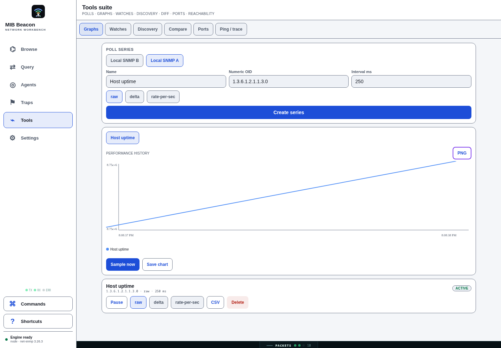
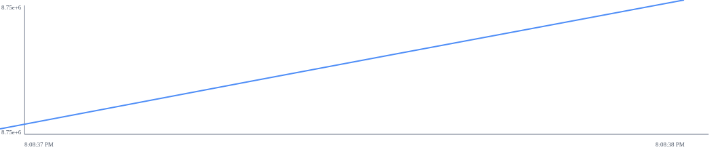
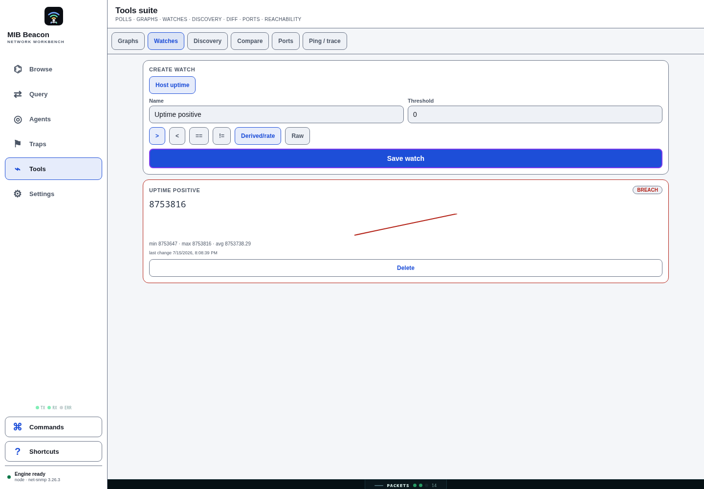
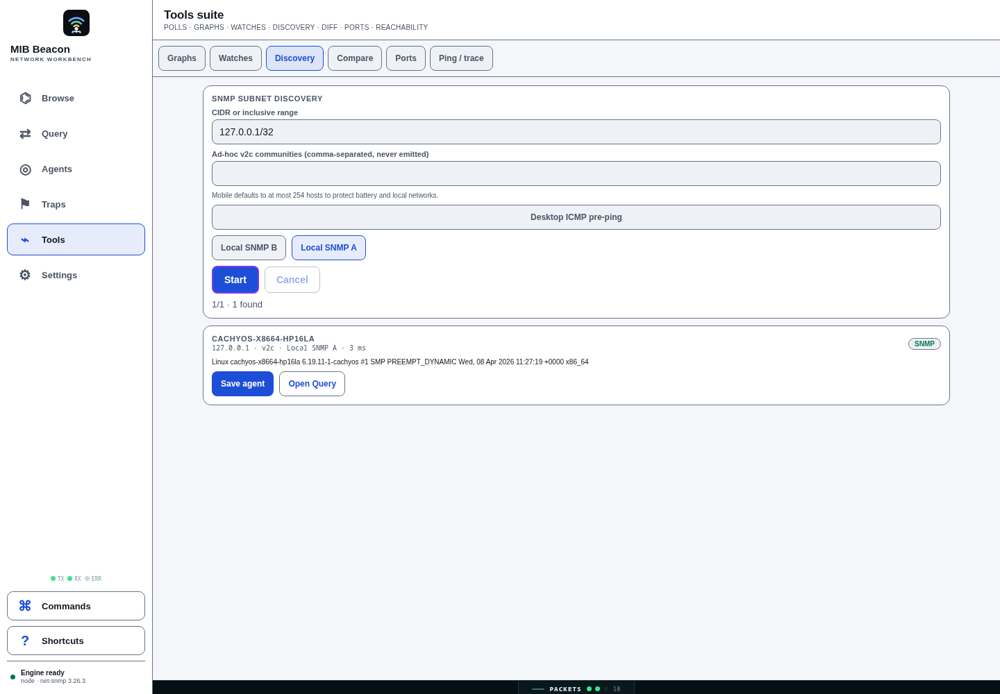
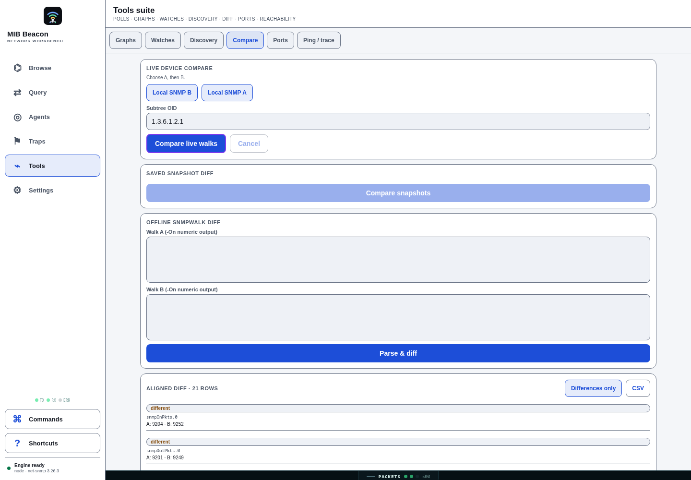
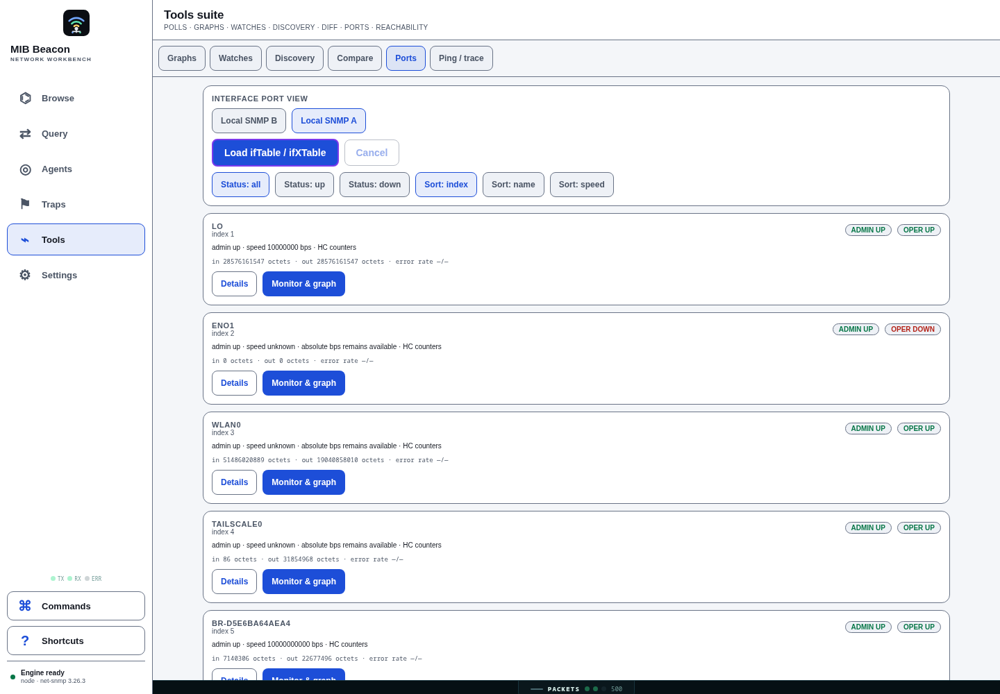
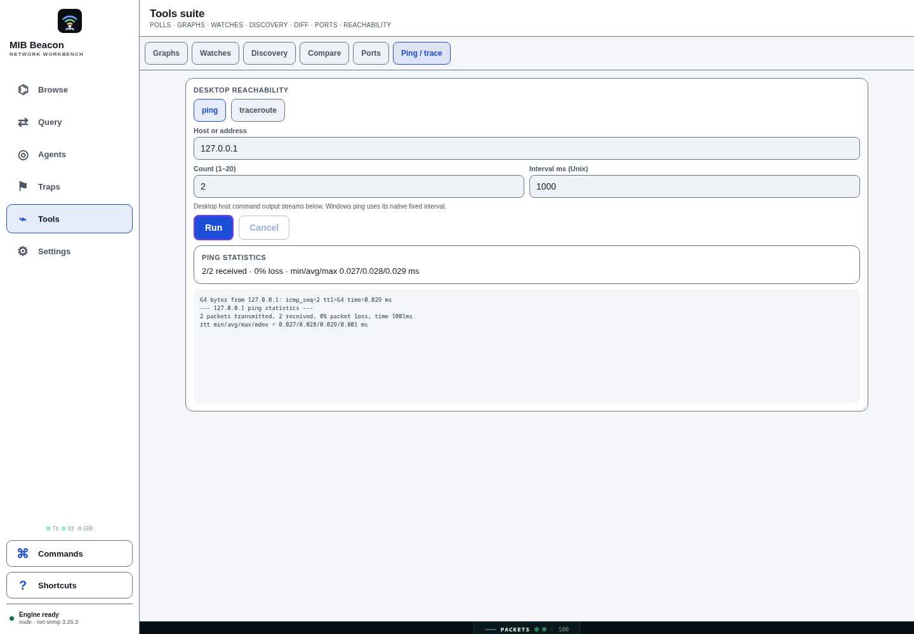

# Tools section browser E2E — 2026-07-15

## Scope and environment

This pass exercised the LAN/server web UI in Chromium at a 1440×1000 viewport against a
real local SNMP daemon at `127.0.0.1:161`. It used an isolated temporary server data
directory and a freshly generated `MIB_BEACON_SERVER_SECRET_KEY`; neither the key nor test
credentials are stored in this repository.

The test created two saved v2c profiles for the local daemon, one raw `sysUpTime` poll
series at 250 ms, and a `> 0` watch. The low interval is only for a quick, observable
chart/watch test; it is not a recommended production polling interval.

## Fixes validated

1. **Server saved-agent support** — the LAN server now injects an AES-256-GCM persistent
   secret store and verifies every saved ciphertext before it starts listening. Before the
   fix, creating an agent through the browser failed because the default Node transport
   refuses to persist unencrypted credentials. Compose now requires
   `MIB_BEACON_SERVER_SECRET_KEY`; a changed valid-looking key or tampered credential file
   now fails startup instead of reporting readiness with unusable profiles. See [the
   LAN-server setup](../../README.md#web-lan-server).
2. **Complete graph history over WebSocket** — the browser proxy now omits trailing
   `undefined` RPC arguments before JSON serialization. Previously, the optional poll-sample
   limit arrived at the server as `null`, which coerced to zero and was clamped to one sample.
   The graph and sparkline therefore had no visible line despite persisted history.

## Results

| Tool | Browser scenario | Observed result |
| --- | --- | --- |
| Graphs | Created a `sysUpTime` series, waited for multiple samples, exported PNG | Multi-point blue history line rendered; exported PNG had the expected PNG signature and rendered successfully. |
| Watches | Saved `Uptime positive` using `value > 0` | The next scheduled sample changed the card to **BREACH** with current/min/max/average data. |
| Discovery | Scanned `127.0.0.1/32` with the saved profile | Completed `1/1 · 1 found`, with the host, SNMP version, credential attribution, latency, and row actions shown. |
| Compare | Live-walked the two saved local profiles | The aligned diff rendered five changed counter/time rows. The profiles intentionally point at the same host, so time-varying counters are expected to differ between serial walks. |
| Ports | Loaded local `ifTable` / `ifXTable` | Rendered live interfaces with admin/oper pills, HC-counter availability, speeds, octets, filters, sorts, and graph actions. |
| Ping | Ran two ICMP probes against `127.0.0.1` | Streamed two replies and showed `2/2 received · 0% loss` plus min/avg/max latency. |

No browser console errors were observed during the final E2E pass.

## Screenshots

### Graph history and export

### Watch breach

### Discovery result

### Live comparison

### Port view

### Ping result

## Automated checks

- `pnpm exec vitest run tests/server-secret-storage.test.ts tests/ws-engine-proxy.test.ts` —
  2 files / 7 tests passed, including ciphertext tamper rejection and a valid-but-wrong
  server key failing before readiness.
- `pnpm typecheck` — all 9 workspace typechecks passed.
- `pnpm lint` and `pnpm test` — passed.
- `docker compose config` accepted a generated valid key and rejected a missing key before
  container startup.
- A direct server startup with an existing credential file and a different valid 32-byte key
  exited before listening with `Unable to decrypt saved server credentials`.
- Browser E2E: saved profiles, graph + PNG export, watch breach, discovery, compare, ports,
  and reachability all completed successfully in the scenario above.
